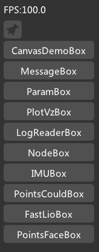
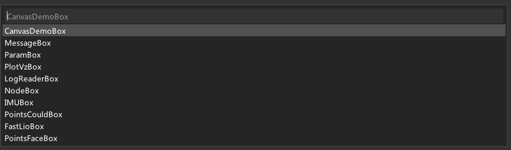
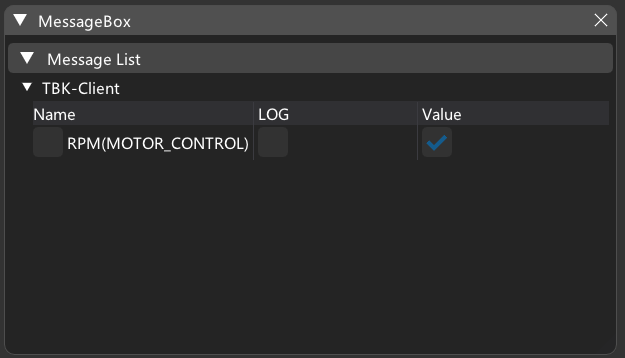
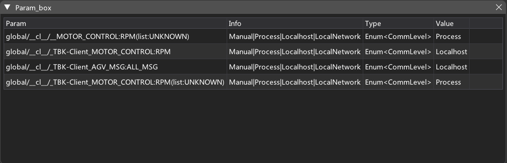
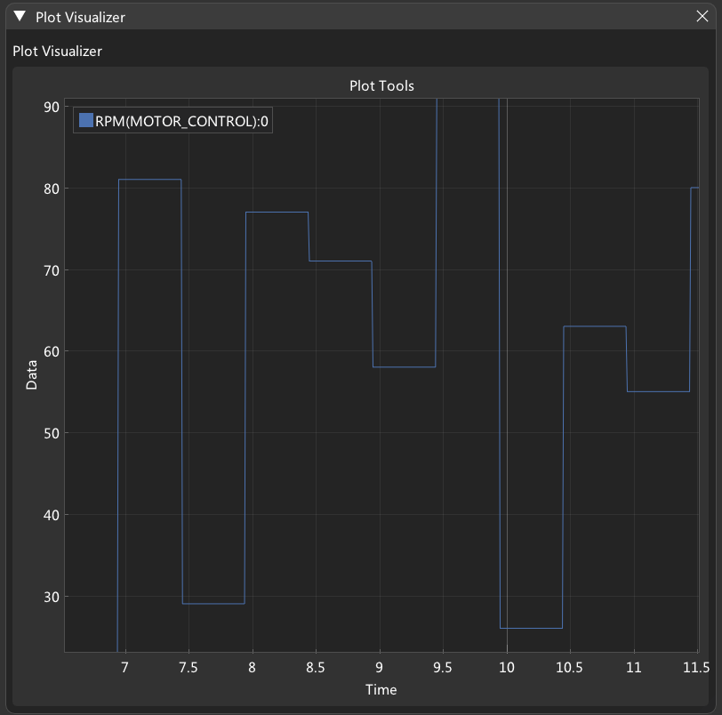
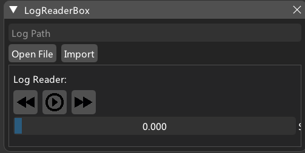
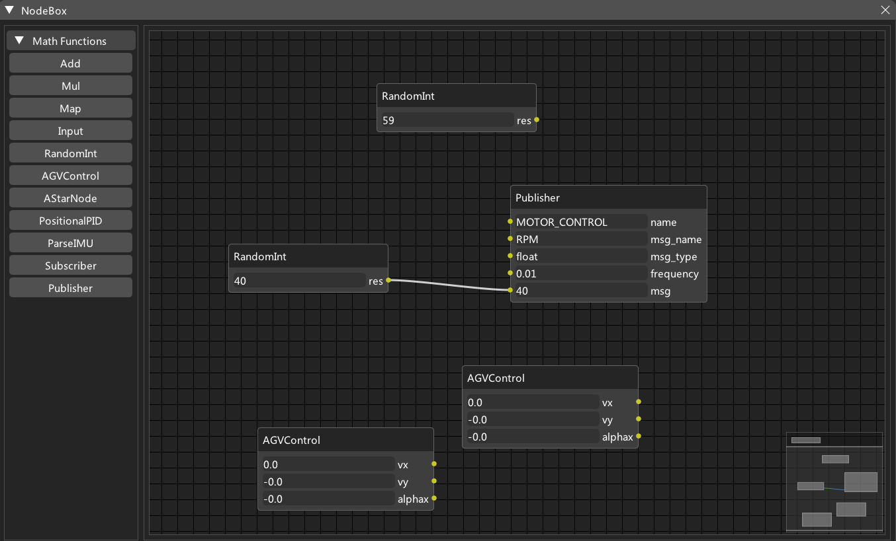
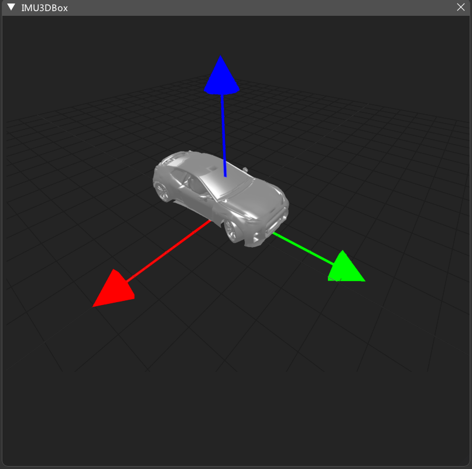
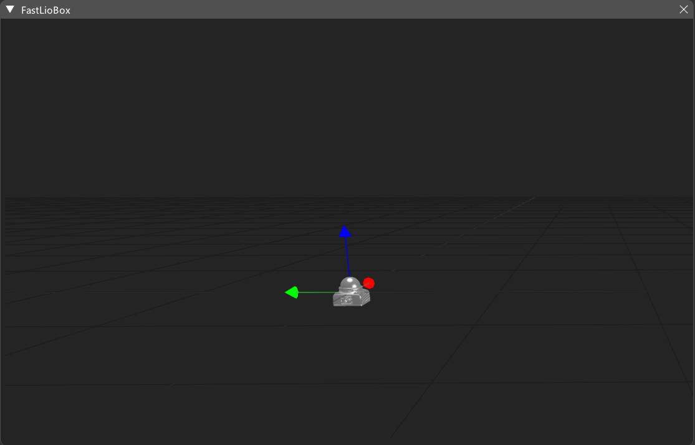

# TBK-Visualizer

## 安装说明

> 在安装本客户端之前，请先安装
>
> - https://turing-zero-bot-kits.readthedocs.io/zh-cn/latest/0_getting_started/0_installation/
> - https://github.com/Turing-zero/tzcp

1. 下载TBK-Visualizer

   ```
   git clone https://github.com/TnTeQAQ/TBK-Client.git
   ```

2. 安装环境依赖

   ```
   pip install -r requirements.txt
   ```

## 使用说明

1. 运行程序

   ```
   make run
   ```

2. `Ctrl+Enter` 唤出Box列表

3. `Ctrl+T` 搜索现有Box

4. `Ctrl+S` 保存Box布局

## 详细说明

### ConsoleBox



`Ctrl+Enter`唤出，可以创建其他Box。

右上角按钮可以将Box始终显示在页面上。

### InputConsoleBox



`Ctrl+T` 唤出，可以通过输入创建其他Box。

### MessageBox



TBK发布的所有Message列表。

### ParamBox



TBK的所有Param列表。

### PlotVzBox



将Message以图表的形式显示。

### LogReaderBox



可以录制和回放Message。

### NodeBox



可视化编程。

### IMUBox



输入IMU，可以以3D的形式显示车辆姿态。

### FastLioBox



输入雷达姿态，点云信息，可以实时构建点云图。

## 开发文档

### 如何编写Box

Box文件夹在`ui/boxes`下，所有的Box都以BaseBox为基类。

在编写Box类时Box的参数由`__init__`函数进行初始化，Box的布局在`create`方法中设置。

当Box需要不断更新数据时，则在Box的`update`方法中编写更新逻辑。

编写好的新Box需要在同文件夹下的`__init__.py`中导入。

例如，

创建一个带有按钮的box，首先在`ui/boxes`下创建一个新的文件`test_box.py`，然后编写如下代码：

```python
import dearpygui.dearpygui as dpg
from ui.boxes.BaseBox import BaseBox
class TestBox(BaseBox):
    # only = True 表示只能创建一个实例
    only = False
    def __init__(self, **kwargs):
        super().__init__(**kwargs)

    def create(self):
        #create 会自动创建dpg窗口， 窗口拥有tag，获取的方法是 self.tag
        # 创建按钮
        dpg.add_button(label="test",parent=self.tag,callback=lambda:print("hello"))
        
    def destroy(self):
        # 销毁之前可以做的事情
        super().destroy() # 真正销毁Box

    def update(self):
        pass

```

然后在`ui/boxes/__init__.py`中加入：

```python
from ui.boxes.test_box import TestBox
```
启动程序，`Ctrl+Enter`唤出Box列表，可以看到新的Box。

### 如何编写Node

Node文件夹在`utils/node_utils`下，所有Node都以BaseNode为基类。

具体实现方式如下：

```python
class Add(BaseNode):
    def __init__(self, **kwargs):
        # 初始化样例
        default_init_data = {
            "x": {
                "attribute_type": "INPUT",
                "data_type": "STRINPUT",
                "user_data":
                    {"value": 0}
            },
            "res": {
                "attribute_type": "OUTPUT",
                "data_type": "SLIDER",
                "user_data": {"value": 0}
            },
            "pos": {
                "attribute_type": "CONFIG",
                "data_type": "CONFIG",
                "user_data":
                    {"value": None}
            }
        }
        kwargs["init_data"] = kwargs["init_data"] or default_init_data
        super().__init__(**kwargs)

    def func(self):
        # 编写计算逻辑
```

 不同的`data_type`，需在types下事先编写。